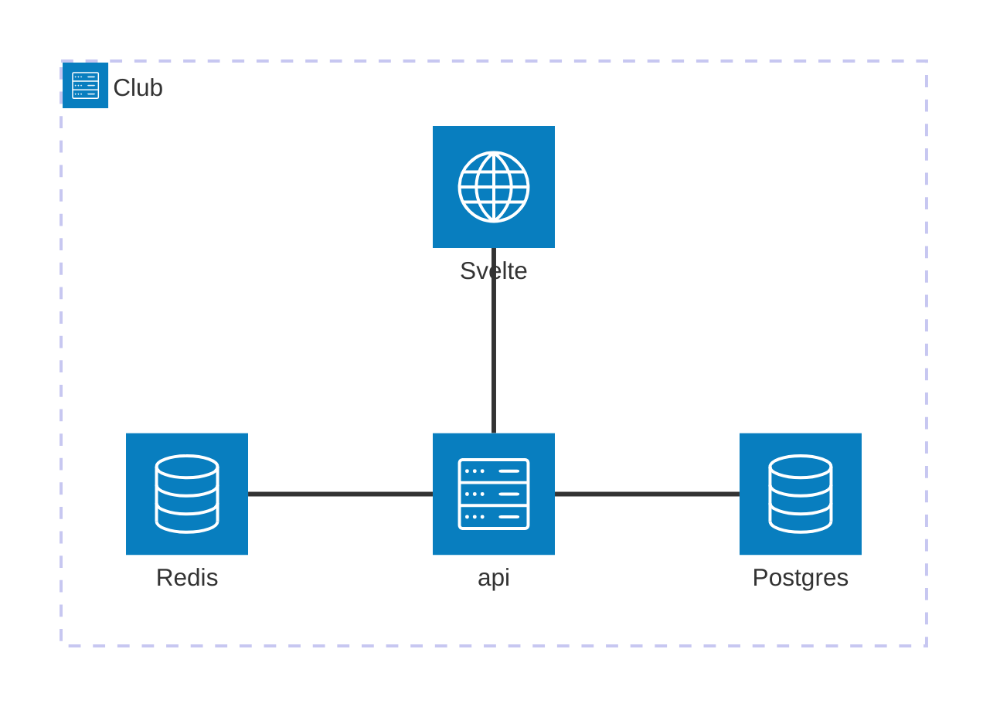

# Club

The public site to book and login as member.

## Setup

```bash
mkcert -install
mkdir -p ./container/traefik/certs
# rm -rf ./container/traefik/certs
mkcert -cert-file ./container/traefik/certs/local-cert.pem -key-file ./container/traefik/certs/local-key.pem "localhost" "*.localhost" "auth.localhost"
# copy certs to ./container/traefik/certs
```

## API (Backend)

```bash
# tool restore and update
dotnet tool restore
dotnet tool update --all

# List updates
dotnet list package --outdated
# Update packages
dotnet package update

# ef
dotnet ef migrations add InitTables --project src/club/club.csproj -c AppDbContext -o ./Data/Migrations
dotnet ef migrations remove --project src/club/club.csproj

# remove
dotnet ef migrations remove --project src/club/club.csproj -c AppDbContext -o ./Data/Migrations

# list dbContexts
dotnet ef dbcontext list --project src/club/club.csproj --startup-project src/club/club.csproj

# TickerQ
dotnet ef migrations add TickerQInit --project src/club/club.csproj -c TickerQDbContext -o ./Data/TickerQMigrations

# squash migrations
dotnet steward squash api/src/club/Data/Migrations
```

### Secrets

```bash
dotnet user-secrets init --project api/src/club
dotnet user-secrets set "Authentication:Google:ClientId" "secret" --project api/src/club
dotnet user-secrets set "Authentication:Google:ClientSecret" "secret" --project api/src/club

dotnet user-secrets set "AWS:AccessKeyId" "secret" --project api/src/club
dotnet user-secrets set "AWS:SecretAccessKey" "secret" --project api/src/club

dotnet user-secrets list --project api/src/club
```

## Client (Front End)

### Start

```bash
# cd client
pnpm dev
```
## Principles

- Simplicity
- Guests should be able to book
- Re-use same UI for members guests and staff where possible
- URLs should be deterministic.
- Mobile First
- Code first DB design

### Diagram



### Temp Booking validation types?

Types of validation checks
- Pre Check (This check happens before a booking is created) - Check if slots are available. Only allow if you lower price if you are part of it.
- Check (This check happens before booking status can become confirmed)

- Logged in
- Has Contract (Needs params, can be comma seperated list?)
- Has Handicap

- Other option can book for guests. All should be members?

Payments can you allow no payment and accept payment on arrival?

Payment Options?
- Pay before
- Pay on arrival
- Deposit %


### Auth Plan

Sync user accounts with identity
Call /users endpoint in identity and sync
Add column lastSync to users table.
Only update if lastUpdate is older than 24 hours.

## Facility Information

Outlet
Description
Address
GPSLink
Tags
Contact Number
Email Address

Facility 
Facility Name
Contact Number
Email Address

Operating Hours
Rule

## Clean up

- Remove old code
- UserManager.FindByEmailAsync() remove all these type of references
