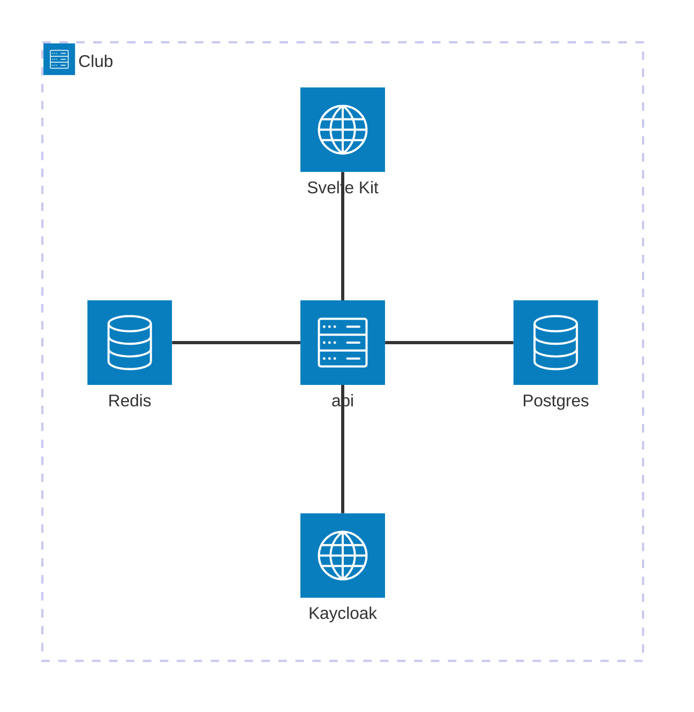

# Club

The public site to book and login as member.

## Diagram


```mermaid
architecture-beta
    group club(server)[Club]

    service db(database)[Postgres] in club
    service redis(database)[Redis] in club
    service api(server)[api] in club
    service svelte(internet)[Svelte Kit] in club
    service keycloak(internet)[Kaycloak] in club

    svelte:B -- T:api
    db:L -- R:api
    redis:R -- L:api
    keycloak:T -- B:api
```

## Principles

- Simplicity
- Re-use same UI for members guests and staff where possible
- URLs should be deterministic.
- Mobile First
- Code first DB design

## Structure

- `Club.AppHost/` - Aspire AppHost for local orchestration
- `Club.Api/` - FastEndpoints backend
- `Club.ServiceDefaults/` - shared Aspire defaults
- `Club.Tests/` - backend integration and unit tests
- `client/` - SvelteKit frontend

## Skills

```bash
# update Skills
npx skills update
rm -rf .agents/skills/aspire*/evals/
```

## Run with Aspire

Start the full local stack through the AppHost:

```bash
aspire start
aspire stop
aspire run
# Direct Run API
dotnet run --project Club.AppHost/Club.AppHost.csproj
pnpm --dir client dev
```

This orchestrates the API, frontend, Postgres, Redis, Keycloak, and Mailpit for local development.

Useful local endpoints when the AppHost is running:

- API docs: `http://localhost:5000/scalar/v1`
- API docs: `http://localhost:5000/tickerq/dashboard/`
- Frontend: `http://localhost:5173`
- Keycloak realm: `http://localhost:8088/realms/kayord`

## API (Backend)

```bash
# tool restore and update
dotnet tool restore
dotnet tool update --all

# List updates
dotnet list package --outdated
dotnet package update

# ef
dotnet ef migrations add InitTables --project Club.Api/Club.Api.csproj --startup-project Club.Api/Club.Api.csproj -c AppDbContext -o ./Data/Migrations
dotnet ef migrations remove --project Club.Api/Club.Api.csproj --startup-project Club.Api/Club.Api.csproj

# remove
dotnet ef migrations remove --project Club.Api/Club.Api.csproj --startup-project Club.Api/Club.Api.csproj -c AppDbContext -o ./Data/Migrations

# list dbContexts
dotnet ef dbcontext list --project Club.Api/Club.Api.csproj --startup-project Club.Api/Club.Api.csproj

# TickerQ
dotnet ef migrations add TickerQInit --project Club.Api/Club.Api.csproj --startup-project Club.Api/Club.Api.csproj -c TickerQDbContext -o ./Data/TickerQMigrations

# squash migrations
dotnet steward squash Club.Api/Data/Migrations

# run the API by itself
dotnet run --project Club.Api/Club.Api.csproj
```

### Secrets

```bash
dotnet user-secrets init --project Club.Api/Club.Api.csproj
dotnet user-secrets set "Authentication:Google:ClientId" "secret" --project Club.Api/Club.Api.csproj
dotnet user-secrets set "Authentication:Google:ClientSecret" "secret" --project Club.Api/Club.Api.csproj

dotnet user-secrets set "AWS:AccessKeyId" "secret" --project Club.Api/Club.Api.csproj
dotnet user-secrets set "AWS:SecretAccessKey" "secret" --project Club.Api/Club.Api.csproj

dotnet user-secrets list --project Club.Api/Club.Api.csproj
```
