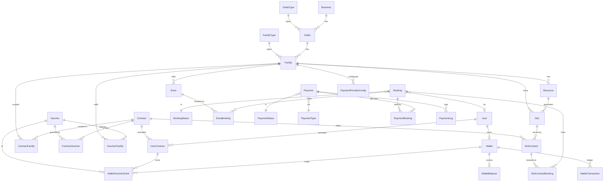

# Database Schema Overview

> Source of truth: `Club.Api/Entities/` + `Club.Api/Data/Config/` (EF Core 10, Npgsql, snake_case naming convention, IdentityDbContext on `user`/`role` tables). Issues and fix recommendations live in [`schema-fix.md`](./schema-fix.md). Domain behaviour docs: [`Wallet.md`](./Wallet.md), [`voucher.md`](./voucher.md), [`Payment.md`](./Payment.md).

## Conventions

- Postgres, all identifiers snake_case via `UseSnakeCaseNamingConvention()` (a few exceptions: `email_log` has PascalCase columns).
- PKs: `int` identity for catalog/config tables, `Guid` for transactional rows (`slot`, `wallet*`, `payment` is `int`).
- Cross-cutting audit columns (`created`, `created_by`, `last_modified`, `last_modified_by`) come from `AuditableEntity` and are stamped in `AppDbContext.SaveChangesAsync` (not an interceptor).
- Status/type reference data is stored as **seeded lookup tables** whose IDs mirror C# enums in `Club.Common.Enums` (`BookingStatusEnum`, `PaymentStatusEnum`, …). Enums in `Voucher`/`PaymentProviderConfig` are stored as raw columns instead (see fix doc).
- Money columns are unconstrained Postgres `numeric`; there are no CHECK constraints and no concurrency tokens anywhere.

## Domain map

## Organisation & catalog

| Table | PK | Key columns / relationships | Notes |
| --- | --- | --- | --- |
| `business` | int | `name` | Top of the org hierarchy. |
| `outlet` | int | `slug` (**unique**), `business_id`, `vat_number`, `display_name`, `outlet_type_id`, `is_active`, free-text info fields | Storefront. Has a stored generated `search_vector` tsvector (name/display_name/description/address/tags) + GIN index. |
| `outlet_type` | int | `name` | Lookup. |
| `facility` | int | `name`, `outlet_id`, `facility_type_id`, `is_active` (nullable bool), contact/rules/hours text | Bookable venue (e.g. golf course). |
| `facility_type` | int | `name` | Lookup. |
| `resource` | int | `name`, `facility_id`, `is_active` | Physical unit (court/tee). |
| `extra` | int | `facility_id`, **`outlet_id` (duplicated)**, `name`, `code`, `price`, `is_available`, `is_online` | Add-on item (burger, cart). Belongs to both a facility and an outlet — redundant (facility → outlet). |
| `validation` | int | `name` | Seeded ("Login", "HNA Verify"); gates who may book a `SlotContract`. |

## Contracts & vouchers

| Table | PK | Key columns / relationships | Notes |
| --- | --- | --- | --- |
| `contract` | int | `name`, `price`, `frequency` (int, default 12), `start_date`, `end_date`, `is_active` | Sellable product (membership, guest pass). |
| `contract_facility` | (contract_id, facility_id) | M:M scope of a contract | Cascade from both sides. |
| `voucher` | int | `name`, `description`, `is_extra` (target: extra vs slot), `redemption_kind` (int enum), `discount_mode?`, `discount_value?`, `max_discount_amount?` | Catalog definition per [voucher.md](./voucher.md). Not auditable. |
| `contract_voucher` | (contract_id, voucher_id) | `amount` (default 1) | What a contract grants; meaning of amount depends on `redemption_kind`. |

## Scheduling

| Table | PK | Key columns / relationships | Notes |
| --- | --- | --- | --- |
| `slot` | **Guid (v7)** | `resource_id?`, **`facility_id?` (duplicated)**, `start_datetime`, `end_datetime?`, `max_bookings` (default 1) | Pre-materialised bookable time window. `facility_id` duplicates `resource.facility_id`; both nullable. **No index on `start_datetime`.** |
| `slot_contract` | int | `slot_id`, `contract_id`, `price`, `validation_id?`, `can_pay_later`, `description?` | A bookable offer: "this slot under this contract at this price" (e.g. 9 holes vs 18 holes). Not a pure join — carries price/terms. |
| `slot_config` / `slot_config_type` | int | weekday/start/end/interval/group_count | Designed to replace the hardcoded random slot generator; **currently mapped but unused**. |
| `resource_slot_config` | — | — | Entity exists in code but is **not mapped** (dead code). |

Slots are currently generated 7 days ahead by `SeedDbContext.EnsureSlotCoverage` / `SlotJob` with random demo pricing (not driven by `slot_config` yet).

## Booking

| Table | PK | Key columns / relationships | Notes |
| --- | --- | --- | --- |
| `booking` | int | `booking_status_id`, `booking_status_date`, `user_id?`, `is_paid`, `amount_paid`, `amount_outstanding`, `expires_at` | The order header. Money totals are hand-maintained columns (no stored total; see fix doc). Guest bookings have `user_id = null`. |
| `slot_contract_booking` | int (surrogate) | `slot_contract_id`, `booking_id`, `user_id?` (**no FK**), `name?`/`email?`/`cellphone?` | One player/line on a slot offer. Contact info denormalised per line. No price snapshot. |
| `extra_booking` | (extra_id, booking_id) | `amount` (quantity) | **Has a shadow nullable `slot_id` FK + index** created by the unpaired `Slot.ExtraBookings` navigation. No price snapshot. |
| `booking_item` | int | name/price/quantity/total | **Mapped but unused** by any feature. |
| `booking_status` | int | `name` | Lookup seeded to match `BookingStatusEnum` (Pending/Confirmed/Cancelled/Expired). |

Capacity: `slot.max_bookings` minus non-cancelled `slot_contract_booking` rows; enforced in app code with `SELECT … FOR UPDATE` on the slot rows.

Expiry: hourly raw-SQL job flips pending→expired bookings and **deletes their `slot_contract_booking` lines**.

## Payments

| Table | PK | Key columns / relationships | Notes |
| --- | --- | --- | --- |
| `payment` | int | `payment_status_id`, `payment_status_date`, `amount`, `payment_type_id`, `transaction_id` (**unique**), `provider_name`, `provider_reference?`, `redirect_url?`, `form_action_url?`, `form_fields_json?`, `error_message?` | One provider transaction. Provider handoff payload persisted for redirect/form flows (PayFast/Peach). No `currency` column. |
| `payment_booking` | (payment_id, booking_id) | — | M:N payment↔booking. **No per-booking amount** — a payment spanning bookings can't record its split. |
| `payment_status` / `payment_type` | int | `name` | Lookups seeded to match enums (Pending/Completed/Failed/Refunded; PayOnArrival/CreditCard/EFT). |
| `payment_log` | int | `payment_id`, `transaction_id`, `provider_name`, `event_type`, `status`, `message?`, `metadata?`, `created_at` | Append-only provider event log. Indexed on transaction/event/created. |
| `payment_provider_config` | int | `facility_id`, `provider_key`, `type` (string enum), `iv`, `encrypted_settings`, `enabled`; **unique (facility_id, provider_key)** | Per-facility provider credentials, encrypted at rest. |

Successful payment flow (`PaymentResultHandler`) credits `booking.amount_paid` / decrements `amount_outstanding` synchronously; idempotency is app-level.

## Wallet (money) — implemented, not yet wired

| Table | PK | Key columns | Notes |
| --- | --- | --- | --- |
| `wallet` | Guid | `user_id` (**unique**, cascade), `is_active`, `currency` (default "ZAR") | 1:1 with user. Not auditable. |
| `wallet_balance` | Guid (`wallet_id`) | `balance`, `updated_at` | Cache of the ledger; 1:1 split out of `wallet`. |
| `wallet_transaction` | Guid | `wallet_id`, `amount`, `wallet_transaction_type_id`, `wallet_transaction_status_id`, `reference_id`, `created_at` | Append-only ledger. `reference_id` is a polymorphic string (booking/payment id) — **no FK, no unique constraint**. |
| `wallet_transaction_type` / `wallet_transaction_status` | int | `name` | Lookups: Credit/Debit; Pending/Completed/Failed/Refunded. |

See [Wallet.md](./Wallet.md) — balance = Σ completed credits − Σ completed debits.

## Wallet (vouchers) — implemented, not yet wired

| Table | PK | Key columns | Notes |
| --- | --- | --- | --- |
| `voucher_facility` | (voucher_id, facility_id) | — | Scope of validity. **Empty set means valid everywhere** (convention, not a flag). |
| `wallet_voucher_grant` | Guid | `wallet_id`, `user_contract_id` (Restrict), `voucher_id` (Restrict), `amount_granted`, `amount_remaining`, `granted_at`, `expiry_date` | One row per activation batch; `amount_remaining` is drawn down on redemption. Indexed on wallet/voucher/user_contract separately. |

Not yet modelled (documented in [voucher.md](./voucher.md)): `BookingVoucherApplication` (which grant funded which booking line), expiry handling, stacking policy.

## Identity

`user` (IdentityUser<Guid> + first/last name, picture, `last_sync`), `role`, `user_role` (surrogate int PK, unique (user_id, role_id, **nullable** facility_id) — facility-scoped roles), plus standard claim/login/token/passkey tables. The table name `user` is a Postgres reserved word (always quoted by EF; a hazard for raw SQL — see the TickerQ `Sql` job).

## Cross-cutting observations

- **Delete behaviours**: every lookup-table FK cascades (e.g. deleting a `booking_status` row would delete bookings). Detail rows cascade from parents. `booking.user_id` has no DB cascade.
- **Unused/dead schema**: `booking_item` (table exists), `slot_config`/`slot_config_type` (tables exist, unused), `site`/`file_meta`/`resource_slot_config` (entities only, unmapped).
- **No CHECK constraints** on any money/quantity column; **no concurrency tokens**; enums stored inconsistently (lookup tables vs int columns vs string columns).
